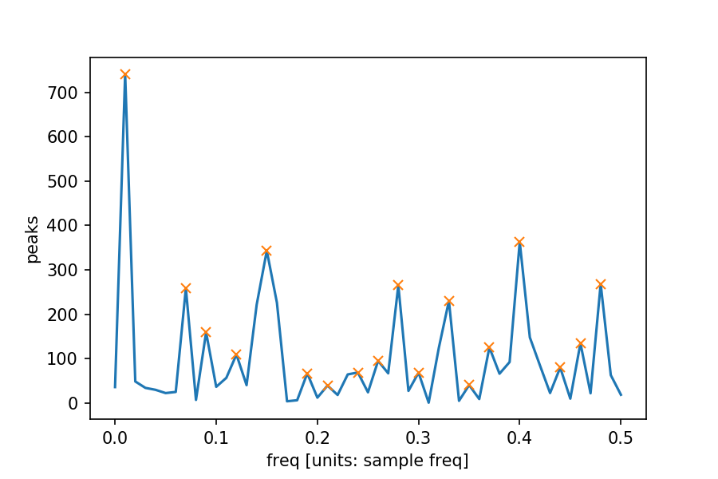

# xaddon
A collection of xarray-based tools often used in atmospheric, ocean and climate science

## example ([notebook](example/xaddon_example.ipynb) 

        import xarray as xr
        import numpy as np
        import xaddon

        np.random.seed(0)
        da = xr.DataArray(np.random.randn(100), dims='day', name='Ta', attrs={'units': 'degC'})

        da.go.power_spectrum() \
            .plot()
        da.go.power_spectrum() \
            .go.find_peaks().peaks \
            .plot(marker='x', linestyle='none')

